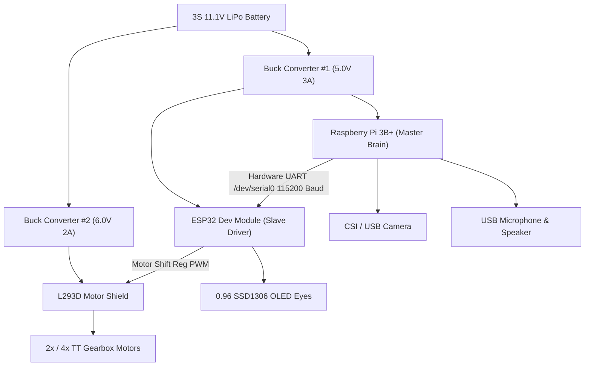
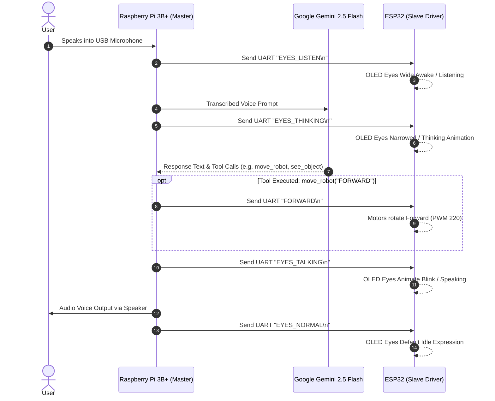

# 🤖 WALL-E — Autonomous AI Companion Robot

[](https://www.python.org/)
[-C51A4A?style=for-the-badge&logo=Raspberry-Pi&logoColor=white)](https://www.raspberrypi.com/)
[](https://www.espressif.com/)
[](https://ai.google.dev/)
[](https://livekit.io/)
[](LICENSE)

**WALL-E** is an ultra-lightweight, zero-lag, RAM-optimized autonomous mini AI companion robot powered by **Raspberry Pi 3B+ (1GB RAM)** as the master brain and an **ESP32 Dev Module** as the motor and OLED expression driver.

Combining real-time multilingual voice AI (**Google Gemini 2.5 Flash**), instant camera vision, dynamic animated OLED eye expressions, and 2WD/4WD differential motor control over hardware UART serial communication.

---

## 🌟 Key Features

- 🗣️ **Multilingual Voice AI**: Conversational natural voice interaction in Hindi, English, Hinglish, Marathi, Tamil, Telugu, and more using Google Gemini 2.5 Flash & LiveKit Agents.
- 👁️ **Instant Camera Vision (`see_object`)**: Captures 640x480 video frames via CSI/USB camera for real-time scene and object analysis using Gemini Vision API.
- 🤖 **Differential Motor Drive (`move_robot`)**: Real-time motor movement (`FORWARD`, `BACKWARD`, `LEFT`, `RIGHT`, `STOP`) driven by ESP32 + L293D Shield over 115200 Baud UART.
- 📺 **Dynamic Animated OLED Eyes**: Expressive 0.96" SSD1306 OLED eyes synced to AI agent states (`EYES_LISTEN`, `EYES_THINKING`, `EYES_TALKING`, `EYES_NORMAL`).
- ⚡ **Low RAM Footprint (< 170 MB)**: Headless, ultra-optimized Python runtime specifically built to run under 1GB RAM on Raspberry Pi 3B+ without freezing or lag.
- 🌦️ **Smart Tools**: Real-time weather check via Open-Meteo API, DuckDuckGo/Wikipedia search, media playback, and time information.

---

## 📐 System Architecture

### Master-Slave Hardware Architecture



---

## 🔄 Interaction Flowchart



---

## 🔌 Pinout & Wiring Matrix

### 1. Power Distribution Network (PDN)
| Source | Target Module | Target Pin | Voltage |
| :--- | :--- | :--- | :--- |
| **3S LiPo (+)** | Main Toggle Switch | In | 11.1V - 12.6V |
| **Buck #1 Output (Adjust to 5.0V)** | Raspberry Pi 3B+ | Pin 2 (`5V`) | 5.0V DC |
| **Buck #1 Output (Adjust to 5.0V)** | ESP32 Board | Pin `VIN / 5V` | 5.0V DC |
| **Buck #2 Output (Adjust to 6.0V)** | L293D Motor Shield | `EXT_PWR (+M)` | 6.0V DC |

### 2. Hardware UART Serial Link (Pi 3B+ to ESP32)
> ⚠️ **Note:** Ground MUST be shared between Raspberry Pi, ESP32, and Buck converters. Cross-connect TX to RX.

| Raspberry Pi 3B+ Pin | Pin Function | ESP32 Pin | ESP32 Pin Function |
| :--- | :--- | :--- | :--- |
| **Pin 8** | `GPIO 14 (TXD0)` | **GPIO 3** | `RX0` |
| **Pin 10** | `GPIO 15 (RXD0)` | **GPIO 1** | `TX0` |
| **Pin 6** | `GND` | **GND** | `GND` |

### 3. OLED Display (0.96" SSD1306) to ESP32
| OLED Pin | ESP32 Pin | Function |
| :--- | :--- | :--- |
| **VCC** | **3.3V** or **5V** | Power |
| **GND** | **GND** | Ground |
| **SDA** | **GPIO 21** | I2C Data |
| **SCL** | **GPIO 22** | I2C Clock |

---

## 📡 Serial Communication Protocol (UART Specs)

- **Baud Rate:** `115200 bps` | **Data Bits:** `8` | **Parity:** `None` | **Stop Bits:** `1`
- **Delimiter:** Newline (`\n`)

| Command String | Target Subsystem | Action Performed | ESP32 OLED Response |
| :--- | :--- | :--- | :--- |
| `FORWARD\n` | Motors | Both motors rotate Forward at PWM 220 | Eyes: Normal |
| `BACKWARD\n` | Motors | Both motors rotate Backward at PWM 220 | Eyes: Normal |
| `LEFT\n` | Motors | Left Reverse, Right Forward (Spin Left) | Eyes: Normal |
| `RIGHT\n` | Motors | Left Forward, Right Reverse (Spin Right) | Eyes: Normal |
| `STOP\n` | Motors | All motor channels disabled (0 PWM) | Eyes: Normal |
| `EYES_LISTEN\n` | OLED Screen | None | Eyes: Wide Awake / Listening |
| `EYES_THINKING\n`| OLED Screen | None | Eyes: Thinking animation |
| `EYES_TALKING\n` | OLED Screen | None | Eyes: Animated Blink / Speaking |
| `EYES_NORMAL\n`  | OLED Screen | None | Eyes: Default idle expression |

---

## 📁 Repository Directory Structure

```
WALL-E/
├── WALL_E_Voice_Assistant/
│   ├── main.py                   # Lightweight Headless Terminal Runner (Zero GUI Overhead)
│   ├── WALL_E_Assistant.py       # Core LiveKit + Gemini 2.5 Flash Agent & Hardware Eye Sync
│   ├── tools.py                  # RAM-optimized tools (move_robot, see_object, weather, search)
│   ├── prompts.py                # System instructions & WALL-E robot identity specifications
│   ├── .env                      # Environment configuration & API keys
│   └── Tools/                    # Additional lightweight tool scripts
├── WALL_E_ESP32/
│   └── WALL_E_ESP32.ino          # ESP32 C++ Firmware (L293D Motor Drive + SSD1306 OLED Eyes)
├── PRD.md                        # Product Requirement Document
├── TRD.md                        # Technical Requirement Document
├── Pinout & Wiring Matrix.md     # Full Hardware Schematic & Wiring Guide
├── Serial Communication Protocol (UART Specs).md # Complete UART Command Protocol
├── System Architecture & Flowcharts.md # High level architecture diagrams
└── README.md                     # Main project documentation & guide
```

---

## 🚀 Quick Start Guide

### 1. Prerequisites (Raspberry Pi 3B+)
Ensure Raspberry Pi OS (Bookworm 64-bit Lite) is installed. Enable Hardware UART serial in Raspberry Pi Configuration:
```bash
sudo raspi-config
# Interface Options -> Serial Port -> Enable Hardware Serial (/dev/serial0), Disable Serial Console
```

### 2. Clone & Environment Setup
```bash
cd ~
git clone https://github.com/Aashutosh2021/WALL-E.git
cd WALL-E/WALL_E_Voice_Assistant

# Create Python virtual environment
python3 -m venv .venv
source .venv/bin/activate

# Install lightweight dependencies
pip install livekit-agents livekit-plugins-google livekit-plugins-noise-cancellation python-dotenv opencv-python aiohttp pyserial
```

### 3. Configure Environment (`.env`)
Create or edit `.env` inside `WALL_E_Voice_Assistant/`:
```env
LIVEKIT_URL=wss://xxxxx-xxxxxxx.livekit.cloud
LIVEKIT_API_KEY=YOUR_LIVEKIT_KEY
LIVEKIT_API_SECRET=YOUR_LIVEKIT_SECRET

GOOGLE_API_KEY=YOUR_GOOGLE_API_KEY
ROBOT_NAME='WALL-E'
USER_NAME='Aashutosh'
WALLE_VARIANT='ultra'
LAN=Hindi
LOG_LEVEL=INFO
SERIAL_PORT='/dev/serial0'
BAUD_RATE=115200
```

### 4. Flash ESP32 Firmware
Open `WALL_E_ESP32/WALL_E_ESP32.ino` in Arduino IDE, select **ESP32 Dev Module**, install `Adafruit_SSD1306` and `Adafruit_GFX` libraries, and upload to the ESP32 board.

### 5. Launch WALL-E Robot (Headless Terminal Mode)
```bash
cd ~/WALL-E/WALL_E_Voice_Assistant
source .venv/bin/activate
python main.py dev
```

---

## 👤 Author & Credits

- **Creator & Lead Developer:** [Aashutosh Kumar](https://github.com/Aashutosh2021)
- **Built For:** Desktop AI Robotics & Low-Power Embedded Systems
- **License:** MIT License
