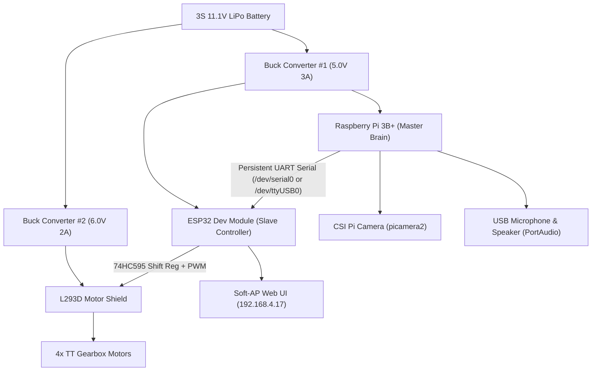
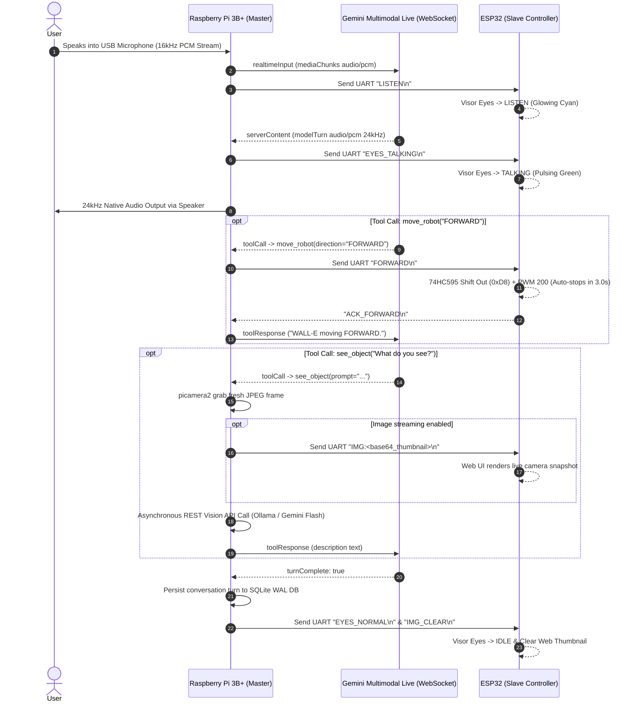

# 🤖 WALL-E — Autonomous AI Companion Robot

[](https://www.python.org/)
[](https://www.raspberrypi.com/)
[](https://www.espressif.com/)
[](https://ai.google.dev/)
[](https://ollama.com/)
[](https://sqlite.org/)
[](LICENSE)

**WALL-E** is an ultra-low-latency, zero-lag, autonomous mini AI companion robot. It uses a **Raspberry Pi 3B+** as the primary master brain and an **ESP32 Dev Module** as the real-time motor controller and animated expression driver.

Driven by Google's **Gemini Multimodal Live API (`BidiGenerateContent`)** over raw WebSockets, WALL-E provides instant, human-like voice conversations (sub-100ms first-byte audio latency), real-time computer vision via Ollama Cloud or Gemini Flash, animated web-based OLED eye expressions, 4-wheel differential motor movement, persistent SQLite conversation memory, and autonomous agent tools.

---

## 🌟 Key Features

- ⚡ **Direct Gemini Multimodal Live API**: Full-duplex bidirectional streaming voice AI over WebSockets with native 16kHz PCM audio ingest (32ms/64ms chunks) and 24kHz speaker playback (`Puck` voice). Natural user barge-in/interruption supported out-of-the-box.
- 🧠 **Persistent SQLite Conversation Memory**: Uses SQLite in WAL mode (`conversation_memory.py`) to log all turns (user, assistant, tool calls). Automatically formats recent context on startup so WALL-E remembers previous interactions across reboots.
- 👁️ **Persistent Warm Camera Vision (`see_object`)**: `picamera2` stream kept warm in memory with stale-frame purging. Vision requests execute via asynchronous REST API calls (Ollama Cloud `gemma4` or Gemini 3.5 Flash) with optional real-time thumbnail streaming to the ESP32 Web UI.
- 🤖 **4-Wheel Differential Drive (`move_robot`)**: 4-channel DC motor control via 74HC595 shift register and hardware PWM on L293D shield. Features calibrated auto-stop timers: 3.0s for `FORWARD`/`BACKWARD` and 0.7s for `LEFT`/`RIGHT` spins.
- 📺 **Interactive ESP32 Web Dashboard & OLED Visor**: ESP32 Soft-AP (`WALL-E_AP` @ `http://192.168.4.17`) hosting real-time animated CSS OLED visor eyes (`TALKING`, `LISTEN`, `THINK`, `HAPPY`, `ANGRY`, `SAD`, `NORMAL`), live camera thumbnails, and scrolling serial console logs (`/getStatus` AJAX polled every 200ms).
- 🌦️ **Autonomous Agent Tools**:
  - `get_weather`: Auto-detects location from public IP, caches coordinates, and fetches Open-Meteo forecasts in < 80ms.
  - `search_web`: Parallel DuckDuckGo and Wikipedia queries via `asyncio.gather`.
  - `get_time_info`: Live date, time, and weekday info.
  - `remember_fact`: User fact retention stored in `memory.json`.
- 🪶 **Ultra-Low Memory Footprint (< 80 MB)**: Headless, optimized Python runtime tailored to run smoothly on Raspberry Pi 3B+ (1GB RAM) without overheating or freezing.

---

## 📐 System Architecture

### Master-Slave Hardware Architecture



---

## 🔄 Interaction Flowchart



---

## 🔌 Pinout & Wiring Matrix

### 1. Power Distribution Network (PDN)
| Source | Target Module | Target Pin | Voltage |
| :--- | :--- | :--- | :--- |
| **3S LiPo (+)** | Main Toggle Switch | In | 11.1V - 12.6V |
| **Buck #1 Output (Adjust to 5.0V)** | Raspberry Pi 3B+ | Pin 2 (`5V`) | 5.0V DC |
| **Buck #1 Output (Adjust to 5.0V)** | ESP32 Board | Pin `VIN / 5V` | 5.0V DC |
| **Buck #2 Output (Adjust to 6.0V)** | L293D Motor Shield | `EXT_PWR (+M)` | 6.0V DC |

### 2. ESP32 to L293D Motor Shield (74HC595 Shift Register & PWM)
| Signal Name | ESP32 GPIO | L293D Shield Function |
| :--- | :--- | :--- |
| **DIR_CLK** | `GPIO 16` | Shift Register Clock (Digital Pin 4) |
| **DIR_EN** | `GPIO 17` | Shift Register Enable / Active LOW (Digital Pin 7) |
| **DIR_SER** | `GPIO 5` | Shift Register Serial Data (Digital Pin 8) |
| **DIR_LATCH** | `GPIO 18` | Shift Register Latch (Digital Pin 12) |
| **PWM_M1** | `GPIO 19` | Motor 1 Speed PWM (D11) |
| **PWM_M2** | `GPIO 23` | Motor 2 Speed PWM (D3) |
| **PWM_M3** | `GPIO 25` | Motor 3 Speed PWM (D5) |
| **PWM_M4** | `GPIO 26` | Motor 4 Speed PWM (D6) |

---

## 📡 Serial Communication Protocol (UART Specs)

- **Baud Rate:** `115200 bps` or `9600 bps` | **Data Bits:** `8` | **Parity:** `None` | **Stop Bits:** `1`
- **Port:** `/dev/serial0` or `/dev/ttyUSB0` (configured via `.env`)
- **Delimiter:** Newline (`\n`)

| Command String | Category | Action Performed | Auto-Stop Duration | ESP32 Response |
| :--- | :--- | :--- | :--- | :--- |
| `FORWARD\n` | Motor | 4 Motors Forward (PWM 200) | **3.0 seconds** | `ACK_FORWARD` |
| `BACKWARD\n` | Motor | 4 Motors Backward (PWM 200) | **3.0 seconds** | `ACK_BACKWARD` |
| `LEFT\n` | Motor | Spin Left (PWM 200) | **0.7 seconds** | `ACK_LEFT` |
| `RIGHT\n` | Motor | Spin Right (PWM 200) | **0.7 seconds** | `ACK_RIGHT` |
| `STOP\n` | Motor | Stop all motors immediately (PWM 0) | Immediate | `ACK_STOP` |
| `EYES_TALKING\n` / `SPEAK\n` | Expression | Visor Eyes: Pulsing Green (Talking Animation) | Continuous | `ACK_EYES_TALKING` |
| `LISTEN\n` | Expression | Visor Eyes: Glowing Cyan (Listening) | While listening | `ACK_LISTEN` |
| `EYES_THINKING\n` / `THINK\n` | Expression | Visor Eyes: Pulsing Yellow (Thinking) | While processing | `ACK_THINK` |
| `HAPPY\n` | Expression | Visor Eyes: Curved Magenta Arcs | State switch | `ACK_HAPPY` |
| `ANGRY\n` | Expression | Visor Eyes: Slanted Red Eyebrows | State switch | `ACK_ANGRY` |
| `SAD\n` | Expression | Visor Eyes: Droopy Blue Eyes | State switch | `ACK_SAD` |
| `EYES_NORMAL\n` / `IDLE\n` | Expression | Visor Eyes: Default Blue Visor | Idle state | `ACK_IDLE` |
| `IMG:<base64>\n` | Camera | Sets live JPEG thumbnail on ESP32 Web UI | On vision call | None |
| `IMG_CLEAR\n` | Camera | Clears JPEG thumbnail from ESP32 Web UI | Turn complete | `ACK_IMG_CLEAR` |

---

## 📁 Repository Directory Structure

```
WALL-E/
├── WALL_E_Voice_Assistant/
│   ├── main.py                   # Clean Python Entry Launcher
│   ├── walle_direct_gemini.py    # Direct Gemini Multimodal Live WebSocket Client
│   ├── conversation_memory.py    # SQLite WAL Persistent Conversation History
│   ├── tools.py                  # Hardware UART & Agent Tools (movement, weather, search, memory)
│   ├── prompts.py                # System prompt, personality & identity rules
│   ├── memory.json               # Fact memory store
│   ├── requirements.txt          # Python dependencies
│   └── .env                      # API keys & hardware configuration
├── WALL_E_ESP32/
│   └── WALL_E_ESP32.ino          # ESP32 C++ Firmware (USB Serial, L293D Motors & Web UI)
├── ESP_UART/
│   └── WALL_E_ESP32_UART/
│       └── WALL_E_ESP32_UART.ino # ESP32 C++ Firmware (UART2 GPIO4/27 Hardware Serial)
├── PRD.md                        # Product Requirement Document
├── TRD.md                        # Technical Requirement Document
├── Pinout & Wiring Matrix.md     # Full Hardware Schematic & Wiring Guide
├── Serial Communication Protocol (UART Specs).md # UART Protocol Specification
├── System Architecture & Flowcharts.md # Architecture & sequence flowcharts
└── README.md                     # Main project guide
```

---

## 🚀 Quick Start Guide

### 1. Prerequisites (Raspberry Pi OS 64-bit Lite)
Enable camera and serial hardware support:
```bash
sudo raspi-config
# Interface Options -> Camera -> Enable
# Interface Options -> Serial Port -> Enable Hardware Serial (/dev/serial0 or /dev/ttyUSB0)
```

### 2. Installation & Setup
```bash
cd ~
git clone https://github.com/Aashutosh2021/WALL-E.git
cd WALL-E/WALL_E_Voice_Assistant

# Create Python virtual environment
python3 -m venv .venv
source .venv/bin/activate

# Install dependencies
pip install -r requirements.txt
```

### 3. Configure Environment (`.env`)
Create or edit `.env` inside `WALL_E_Voice_Assistant/`:
```env
GEMINI_LIVE_MODEL=models/gemini-2.5-flash-native-audio-preview-12-2025
GOOGLE_API_KEY=YOUR_GOOGLE_API_KEY
ROBOT_NAME='WALL-E'
USER_NAME='Aashutosh'
LAN=Hindi,English
SERIAL_PORT=/dev/serial0
BAUD_RATE=9600
MIC_CHUNK=512
ENABLE_VISION=1
ENABLE_ESP32_IMAGE=0
MEMORY_TURNS=30

# Optional: Ollama Cloud Vision
OLLAMA_CLOUD_URL=https://ollama.com
OLLAMA_API_KEY=YOUR_OLLAMA_KEY
OLLAMA_VISION_MODEL=gemma4:31b-cloud
```

### 4. Flash ESP32 Firmware
Open `WALL_E_ESP32/WALL_E_ESP32.ino` (for USB) or `ESP_UART/WALL_E_ESP32_UART/WALL_E_ESP32_UART.ino` (for hardwired GPIO UART2) in Arduino IDE, select **ESP32 Dev Module**, and upload.

### 5. Launch WALL-E Robot
```bash
cd ~/WALL-E/WALL_E_Voice_Assistant
source .venv/bin/activate
python3 main.py
```

To view the live web visor and logs, connect your phone or laptop to Wi-Fi SSID `WALL-E_AP` (Password: `password123`) and open `http://192.168.4.17` in your browser.

---

## 👤 Author & Credits

- **Creator & Lead Developer:** [Aashutosh Kumar](https://github.com/Aashutosh2021)
- **Built For:** Real-Time Multimodal Robotics & Embedded AI
- **License:** MIT License
