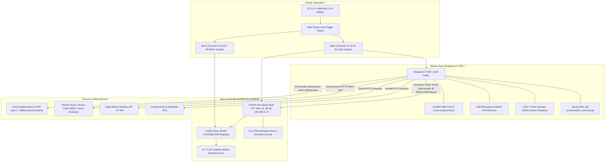

# System Architecture & Flowcharts

## 1. Hardware Block Diagram Architecture



---

## 2. Interaction & Message Flowchart

```mermaid
sequenceDiagram
    autonumber
    actor User
    participant Mic as USB Microphone
    participant Pi as Raspberry Pi Runtime (Python)
    participant GeminiLive as Gemini Live WebSocket
    participant VisionAPI as Vision REST API (Ollama/Flash)
    participant ESP32 as ESP32 Motor & Web Server
    participant Spk as Audio Speaker

    Note over User,Mic: 1. Audio Streaming & Ingest
    User->>Mic: "WALL-E, move forward and tell me what you see"
    Mic->>Pi: 16kHz PCM chunks (32ms/64ms)
    Pi->>GeminiLive: realtimeInput.mediaChunks (audio/pcm;rate=16000)
    Pi->>ESP32: Send UART "LISTEN\n"
    ESP32-->>ESP32: Visor Eyes -> LISTEN (Cyan Glow)

    Note over GeminiLive,Pi: 2. Model Streaming & Tool Calling
    GeminiLive-->>Pi: toolCall: move_robot(direction="FORWARD")
    Pi->>ESP32: Send UART "FORWARD\n"
    ESP32-->>ESP32: Shift Out 0xD8 + PWM 200 (Auto-stops in 3.0s)
    ESP32-->>Pi: "ACK_FORWARD\n"
    Pi->>GeminiLive: toolResponse: "WALL-E moving FORWARD."

    GeminiLive-->>Pi: toolCall: see_object(prompt="describe surroundings")
    Pi->>Pi: picamera2 grab warm fresh JPEG (drops stale frames)
    opt Live Thumbnail Enabled
        Pi->>ESP32: Send UART "IMG:<base64>\n"
        ESP32-->>ESP32: Web UI displays camera snapshot
    end
    Pi->>VisionAPI: Async REST Call (Ollama / Gemini Flash)
    VisionAPI-->>Pi: "I see a laptop and a mug on the desk."
    Pi->>GeminiLive: toolResponse: "I see a laptop and a mug on the desk."

    Note over GeminiLive,Spk: 3. Spoken Audio Playback
    GeminiLive-->>Pi: serverContent.modelTurn (24kHz PCM audio)
    Pi->>ESP32: Send UART "EYES_TALKING\n"
    ESP32-->>ESP32: Visor Eyes -> TALKING (Pulsing Green)
    Pi->>Spk: 24kHz Native PCM Stream
    Spk-->>User: WALL-E speaks in Puck voice

    GeminiLive-->>Pi: turnComplete: true
    Pi->>Pi: Save user & assistant turn to SQLite DB
    Pi->>ESP32: Send UART "EYES_NORMAL\n" & "IMG_CLEAR\n"
    ESP32-->>ESP32: Visor Eyes -> IDLE & Web thumbnail cleared
```