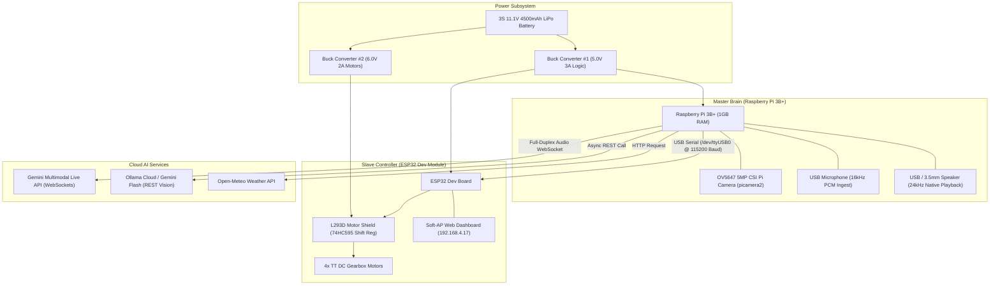
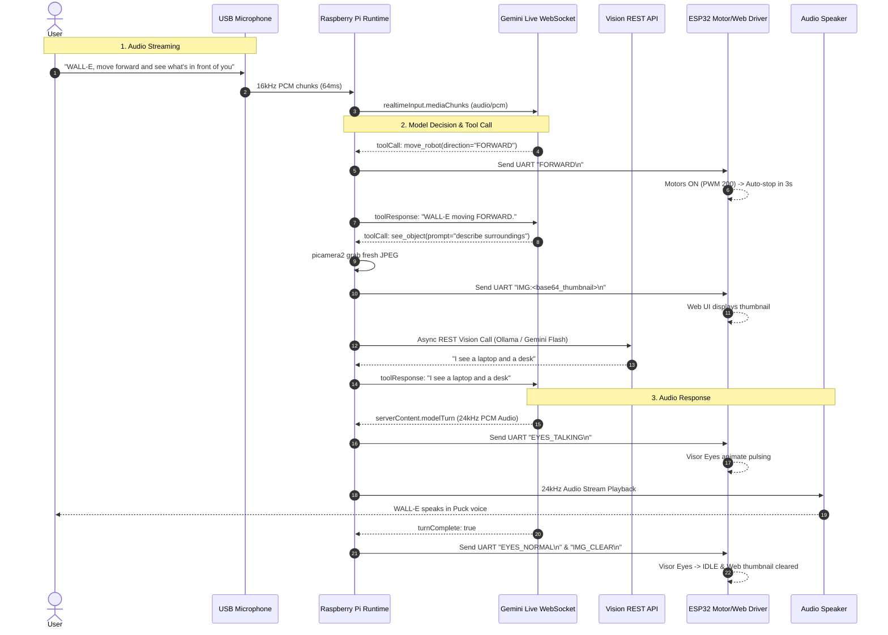

# System Architecture & Flowcharts

## 1. Hardware Block Diagram Architecture

```mermaid
graph TD
    subgraph Power ["Power Subsystem"]
        BAT["3S 11.1V 4500mAh LiPo Battery"]
        BUCK1["Buck Converter #1 (5.0V 3A Logic)"]
        BUCK2["Buck Converter #2 (6.0V 2A Motors)"]
        BAT --> BUCK1
        BAT --> BUCK2
    end

    subgraph Master ["Master Brain (Raspberry Pi 3B+)"]
        PI["Raspberry Pi 3B+ (1GB RAM)"]
        CAM["OV5647 5MP CSI Pi Camera (picamera2)"]
        MIC["USB Microphone (16kHz PCM Ingest)"]
        SPK["USB / 3.5mm Speaker (24kHz Native Playback)"]
        
        PI --- CAM
        PI --- MIC
        PI --- SPK
    end

    subgraph Slave ["Slave Controller (ESP32 Dev Module)"]
        ESP["ESP32 Dev Board"]
        L293D["L293D Motor Shield (74HC595 Shift Reg)"]
        MOTORS["4x TT DC Gearbox Motors"]
        WEB["Soft-AP Web Dashboard (192.168.4.17)"]
        
        ESP --> L293D
        L293D --> MOTORS
        ESP --- WEB
    end

    subgraph Cloud ["Cloud AI Services"]
        GEMINI["Gemini Multimodal Live API (WebSockets)"]
        VISION["Ollama Cloud / Gemini Flash (REST Vision)"]
        OPENMETEO["Open-Meteo Weather API"]
    end

    BUCK1 --> PI
    BUCK1 --> ESP
    BUCK2 --> L293D

    PI -- "USB Serial (/dev/ttyUSB0 @ 115200 Baud)" --> ESP
    PI -- "Full-Duplex Audio WebSocket" --> GEMINI
    PI -- "Async REST Call" --> VISION
    PI -- "HTTP Request" --> OPENMETEO
```

---

## 2. Interaction & Message Flowchart

```mermaid
sequenceDiagram
    autonumber
    actor User
    participant Mic as USB Microphone
    participant Pi as Raspberry Pi Runtime
    participant GeminiLive as Gemini Live WebSocket
    participant VisionAPI as Vision REST API
    participant ESP32 as ESP32 Motor/Web Driver
    participant Spk as Audio Speaker

    Note over User,Mic: 1. Audio Streaming
    User->>Mic: "WALL-E, move forward and see what's in front of you"
    Mic->>Pi: 16kHz PCM chunks (64ms)
    Pi->>GeminiLive: realtimeInput.mediaChunks (audio/pcm)

    Note over GeminiLive,Pi: 2. Model Decision & Tool Call
    GeminiLive-->>Pi: toolCall: move_robot(direction="FORWARD")
    Pi->>ESP32: Send UART "FORWARD\n"
    ESP32-->>ESP32: Motors ON (PWM 200) -> Auto-stop in 3s
    Pi->>GeminiLive: toolResponse: "WALL-E moving FORWARD."

    GeminiLive-->>Pi: toolCall: see_object(prompt="describe surroundings")
    Pi->>Pi: picamera2 grab fresh JPEG
    Pi->>ESP32: Send UART "IMG:<base64_thumbnail>\n"
    ESP32-->>ESP32: Web UI displays thumbnail
    Pi->>VisionAPI: Async REST Vision Call (Ollama / Gemini Flash)
    VisionAPI-->>Pi: "I see a laptop and a desk"
    Pi->>GeminiLive: toolResponse: "I see a laptop and a desk"

    Note over GeminiLive,Spk: 3. Audio Response
    GeminiLive-->>Pi: serverContent.modelTurn (24kHz PCM Audio)
    Pi->>ESP32: Send UART "EYES_TALKING\n"
    ESP32-->>ESP32: Visor Eyes animate pulsing
    Pi->>Spk: 24kHz Audio Stream Playback
    Spk-->>User: WALL-E speaks in Puck voice

    GeminiLive-->>Pi: turnComplete: true
    Pi->>ESP32: Send UART "EYES_NORMAL\n" & "IMG_CLEAR\n"
    ESP32-->>ESP32: Visor Eyes -> IDLE & Web thumbnail cleared
```